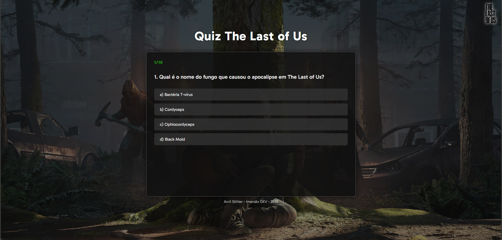

#  🎯 Quiz – The Last of Us 🧟

Um quiz temático desenvolvido com **JavaScript**, inspirado no universo sombrio e emocionante de **The Last of Us**. Teste seus conhecimentos sobre Ellie, Joel, os Vagalumes e o apocalipse causado pelo Cordyceps.

> "Todos que eu amava me deixaram ou morreram, todos... exceto você. Então não diga que eu estaria mais segura com outra pessoa porque a verdade é que eu só estaria mais assustada."
(Ellie)

Clique [aqui](https://avrilstihler.github.io/Quiz-The-Last-Of-Us/) para acessar o game.

## 🕹️ Como jogar

- O jogo apresenta **10 perguntas** de múltipla escolha.
- Ao clicar em uma resposta, o sistema informa se você acertou ou errou.
- A pontuação é contabilizada e exibida ao final.
- Você pode **reiniciar o quiz** para tentar novamente.

Todas as perguntas foram baseadas em acontecimentos importantes de *The Last of Us*.

## 📁 Estrutura dos arquivos

- `index.html`: Interface do jogo  
- `style.css`: Estilos e animações  
- `script.js`: Lógica do jogo e interações  
- `data.js`: Arquivo com todas as perguntas e respostas  

## 🎮 Experiência

✔️ Visual interativo com feedback imediato  
✔️ Respostas corretas são destacadas automaticamente  
✔️ Ideal para fãs da série e do jogo  

---
💻 **Tecnologias utilizadas:** JavaScript, HTML e CSS

